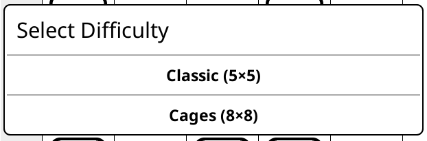
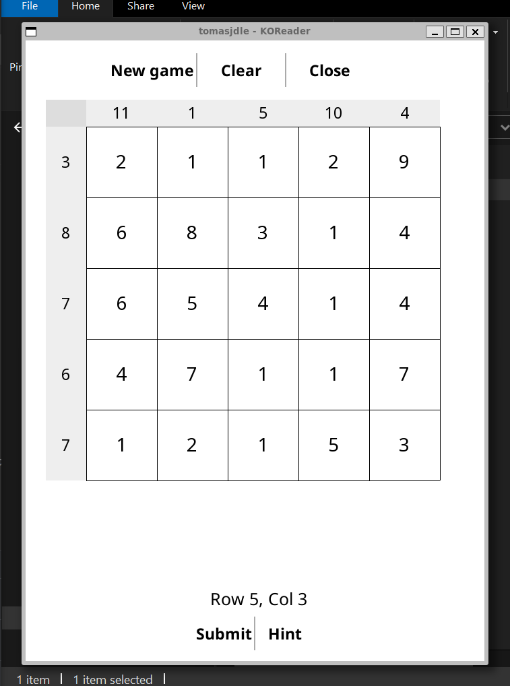
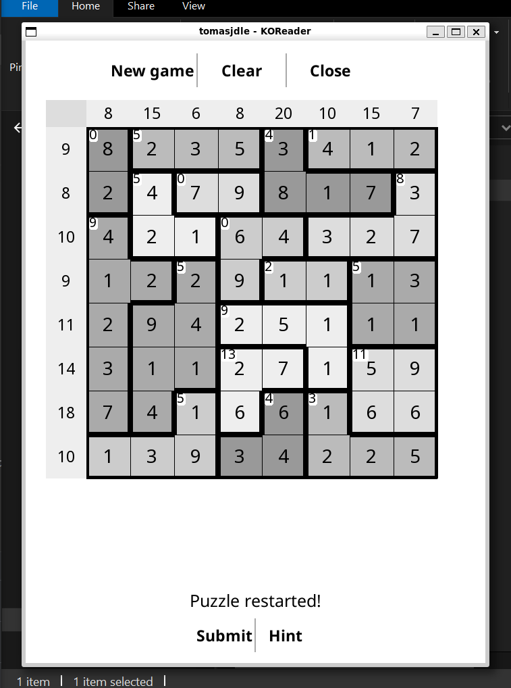
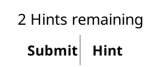
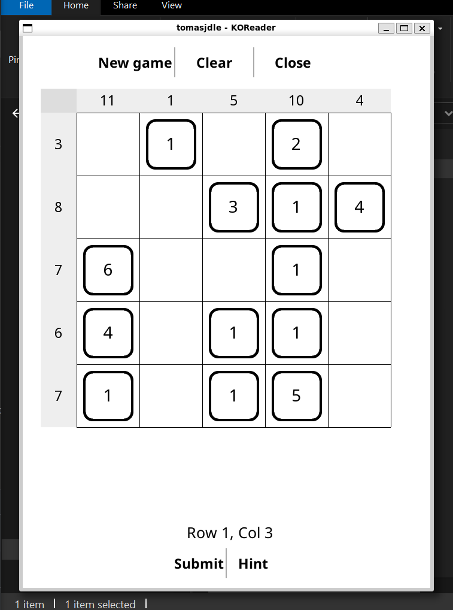
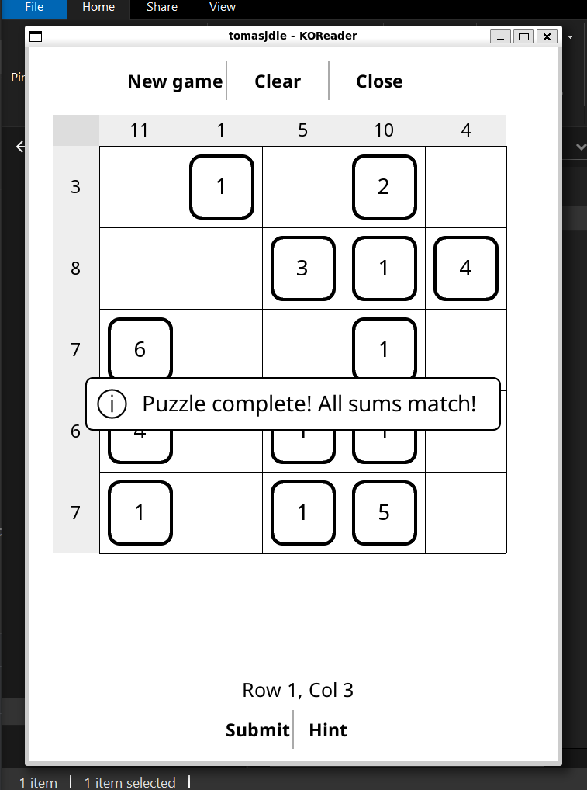

# Sum Puzzle - KOReader Plugin

A number puzzle game for KOReader where you select numbers from a grid to match target sums. Puzzle game inspired by the EasyBrain app Number Sums



## Game Modes

### Classic Mode (5×5)
A straightforward grid where you select numbers that add up to the target sums shown on the edges.



### Cages Mode (8×8)
An advanced mode with irregular "cages" - groups of cells with their own sum targets shown in the top-left corner of each cage.



## Rules

### Objective
Select numbers from the grid so that:
- Each **row's** selected numbers sum to the target shown on the **left edge**
- Each **column's** selected numbers sum to the target shown on the **top edge**
- In **Cages mode**: numbers within each cage must also sum to the cage's target (shown in the cage's top-left corner)

### How to Play

1. **Tap a cell** to cycle through states:
   - **Unselected** - number is visible but not counted
   - **Selected** (bordered) - number counts toward sums
   - **Crossed out** (white text) - number disappears for convenience, not counted

2. **Check your progress**: The status bar shows important information about the game

3. **Use hints**: Click "Hint" to reveal one correct cell (you have 3 hints per puzzle)

4. **Submit**: When you think all sums match their targets, tap "Submit" to check your solution



### Game States


*Example of a completed puzzle*


*Victory message after successful submission*

## Installation

### Requirements
- Tested on KOReader 2025.10
- Tested on Kindle Paperwhite 5 (PW5)

### Installation Steps

1. Download or clone this repository
2. Copy the `sumpuzzle.koplugin` folder to your KOReader plugins directory:
   ```
   /koreader/plugins/sumpuzzle.koplugin/
   ```
3. Restart KOReader
4. Access the game from: **Menu → Tools → Sum Puzzle**

You can also delete this README and the images of the repository!

## Code Structure

```
sumpuzzle.koplugin/
├── kopuzzle                 # barebones framework for puzzle plugin making
├── main.lua                 # Plugin entry point
├── sum_game_logic.lua       # Core game logic and puzzle generation
├── sum_game_renderer.lua    # Visual rendering and cell display
├── sum_game_screen.lua      # UI controls and user interactions
├── cages_generator.lua      # Algorithm for generating irregular cages
└── _meta.lua                # Plugin metadata
```

## Features

- **Two difficulty modes**: Classic 5×5 and advanced Cages 8×8
- **Hint system**: 3 hints per puzzle to help you when stuck
- **State persistence**: Your progress is automatically saved

## Thanks
---
Again, thanks to https://github.com/omer-faruq/ for the base code I used as inspiration
